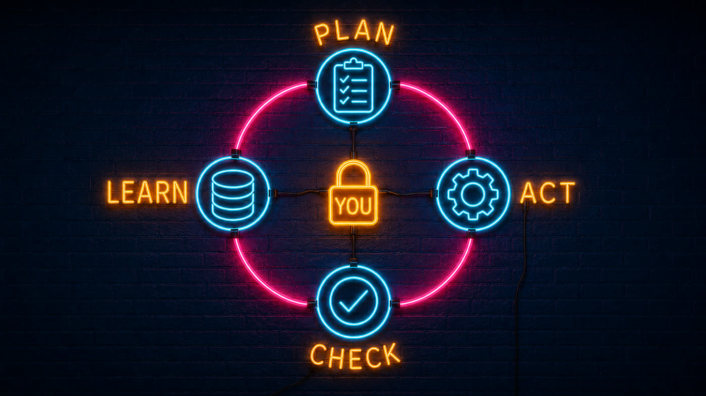
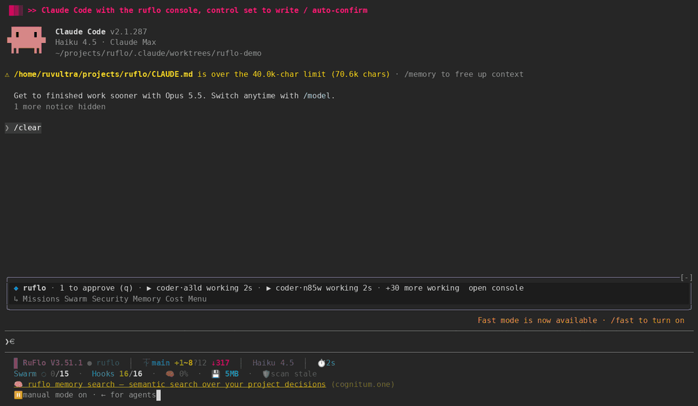

<div align="center">

[](https://cognitum.one/agentic-engineering)

<!-- Try Ruflo — the 3 badges first-time visitors actually act on -->
[](https://www.npmjs.com/package/ruflo)
[](https://opensource.org/licenses/MIT)
[](https://github.com/ruvnet/claude-flow)

<!-- Ecosystem strip (collapsed visually with flat-square) -->
[](https://github.com/ruvnet/ruvector)
[](https://github.com/ruvnet/ruflo/blob/main/data/clone-data.proof.json)
[](https://github.com/ruvnet/ruflo/blob/main/data/clone-data.ledger.json)
[](https://github.com/ruvnet/claude-flow)
[![Codex Plugin](https://img.shields.io/badge/Codex-Plugin-412991?style=flat-square&logoColor=white&logo=data%3Aimage%2Fsvg%2Bxml%3Bbase64%2CPHN2ZyB4bWxucz0iaHR0cDovL3d3dy53My5vcmcvMjAwMC9zdmciIHZpZXdCb3g9IjAgMCAyNCAyNCI%2BPHBhdGggZmlsbD0id2hpdGUiIGQ9Ik0yMi4yODIgOS44MjFhNS45ODUgNS45ODUgMCAwIDAtLjUxNi00LjkxIDYuMDQ2IDYuMDQ2IDAgMCAwLTYuNTEtMi45QTYuMDY1IDYuMDY1IDAgMCAwIDQuOTgxIDQuMThhNS45ODUgNS45ODUgMCAwIDAtMy45OTggMi45IDYuMDQ2IDYuMDQ2IDAgMCAwIC43NDMgNy4wOTcgNS45OCA1Ljk4IDAgMCAwIC41MSA0LjkxMSA2LjA1MSA2LjA1MSAwIDAgMCA2LjUxNSAyLjlBNS45ODUgNS45ODUgMCAwIDAgMTMuMjYgMjRhNi4wNTYgNi4wNTYgMCAwIDAgNS43NzItNC4yMDYgNS45OSA1Ljk5IDAgMCAwIDMuOTk4LTIuOSA2LjA1NiA2LjA1NiAwIDAgMC0uNzQ3LTcuMDczek0xMy4yNiAyMi40M2E0LjQ3NiA0LjQ3NiAwIDAgMS0yLjg3Ni0xLjA0bC4xNDItLjA4IDQuNzc4LTIuNzU4YS43OTUuNzk1IDAgMCAwIC4zOTMtLjY4MXYtNi43MzdsMi4wMiAxLjE2OGEuMDcxLjA3MSAwIDAgMSAuMDM4LjA1MnY1LjU4M2E0LjUwNCA0LjUwNCAwIDAgMS00LjQ5NSA0LjQ5NHpNMy42IDE4LjMwNGE0LjQ3IDQuNDcgMCAwIDEtLjUzNS0zLjAxNGwuMTQyLjA4NSA0Ljc4MyAyLjc1OWEuNzcxLjc3MSAwIDAgMCAuNzgxIDBsNS44NDMtMy4zNjl2Mi4zMzJhLjA4LjA4IDAgMCAxLS4wMzMuMDYyTDkuNzQgMTkuOTVhNC41IDQuNSAwIDAgMS02LjE0LTEuNjQ2ek0yLjM0IDcuODk2YTQuNDg1IDQuNDg1IDAgMCAxIDIuMzY2LTEuOTczVjExLjZhLjc2Ni43NjYgMCAwIDAgLjM4OC42NzdsNS44MTUgMy4zNTQtMi4wMiAxLjE2OGEuMDc2LjA3NiAwIDAgMS0uMDcyIDBsLTQuODMtMi43ODZBNC41MDQgNC41MDQgMCAwIDEgMi4zNCA3Ljg3MnptMTYuNTk3IDMuODU1LTUuODMzLTMuMzg3IDIuMDE2LTEuMTY1YS4wNzYuMDc2IDAgMCAxIC4wNzEgMGw0LjgzIDIuNzkxYTQuNDk0IDQuNDk0IDAgMCAxLS42NzYgOC4xMDR2LTUuNjc3YS43OS43OSAwIDAgMC0uNDA3LS42Njd6bTIuMDEtMy4wMjMtLjE0MS0uMDg1LTQuNzc0LTIuNzgyYS43NzYuNzc2IDAgMCAwLS43ODUgMEw5LjQwOSA5LjIzVjYuODk3YS4wNjYuMDY2IDAgMCAxIC4wMjgtLjA2Mmw0LjgzLTIuNzg3YTQuNDk5IDQuNDk5IDAgMCAxIDYuNjggNC42NnpNOC4zMDcgMTIuODYzbC0yLjAyLTEuMTY0YS4wOC4wOCAwIDAgMS0uMDM4LS4wNTdWNi4wNzRhNC40OTkgNC40OTkgMCAwIDEgNy4zNzYtMy40NTRsLS4xNDIuMDgtNC43NzggMi43NThhLjc5NS43OTUgMCAwIDAtLjM5My42ODJ6bTEuMDk3LTIuMzY2IDIuNjAyLTEuNSAyLjYwNyAxLjV2Mi45OTlsLTIuNTk3IDEuNS0yLjYwNy0xLjVaIi8%2BPC9zdmc%2B)](https://www.npmjs.com/package/@claude-flow/codex)

# Ruflo

[English](README.md) · [简体中文](README.zh-CN.md)

**An agent meta-harness for Claude Code and Codex.**

[](docs/ruflo-explained.md)

**[📖 RuFlo Explained — Build an AI Team That Plans, Remembers, Tests, and Improves](docs/ruflo-explained.md)**
A 14-chapter guide: from the basic idea to a first useful task, then memory, agent teams, plugins, cost and verification.

</div>

> **Agent = Model + Harness.** The model writes; the harness gives it tools, memory, loops, sandboxes, and controls so it can actually work. **Ruflo is the harness** — the execution layer around Claude Code and Codex that adds 100+ specialized agents, coordinated swarms, self-learning memory, federated comms across machines, and enterprise security guardrails. So agents don't just run, they collaborate.

One `npx ruflo init` gives Claude Code a nervous system: agents self-organize into swarms, learn from every task, remember across sessions, and — with federation — securely talk to agents on other machines without leaking data. You keep writing code. Ruflo handles the coordination.

```
Self-Learning / Self-Optimizing Agent Architecture

User --> Ruflo (CLI/MCP) --> Router --> Swarm --> Agents --> Memory --> LLM Providers
                          ^                           |
                          +---- Learning Loop <-------+
```

> **New to Ruflo?** You don't need to learn 314 MCP tools or 26 CLI commands. After `init`, just use Claude Code normally — the hooks system automatically routes tasks, learns from successful patterns, and coordinates agents in the background.

<details>
<summary><strong>📖 Background — where the name comes from</strong></summary>

> Claude Flow is now Ruflo — named by [`rUv`](https://ruv.io), who loves Rust, flow states, and building things that feel inevitable. The "Ru" is the rUv. The "flo" is working until 3am. Underneath, powered by [`Cognitum.One`](https://cognitum.one/?RuFlo) agentic architecture, running a supercharged Rust-based AI engine, embeddings, memory, and plugin system.

</details>

---

<p align="center"></p>

<sub>The <code>/ruflo</code> console running in Claude Code, shown in a compact, near-square frame (the cockpit docked beside Claude, cropped to the cockpit) so it reads on a phone as well as a desktop: the whole boot (the neon sign in its border, the ruvector constellation lit by what is really installed, every area checked, an easter egg), the main menu entering and its cards folding, the grouped nav, a quick tour of twenty-odd pages (the Swarm topology, the Federation map, the Sandbox page for tmux, RVF and RVM, Cost, Memory, Dev Tools and more), the command palette (a tag on every entry for what it does), <b>ruHelp</b> (built-in help: ask a question, get steps with buttons; a guide for every capability), settings and refresh. A <a href="docs/assets/ruflo-console-walkthrough-wide.gif">wide-display walkthrough</a> shows the same console with room for every label. <code>npx ruflo init</code>, restart Claude Code, then <code>/ruflo</code>.</sub>

**Let Claude drive the console.** The console can also be driven *by* Claude: with control turned on (Settings → Claude control), Claude gets four tools (`console_state`, `console_open`, `console_set`, `console_run`) and sets up a mission, opens the Learning Lab or Security page, or runs a palette entry, while the cockpit shows it happening. How far it may go is your setting (`read`, `write`, `manage`, `full`: an action above the level is refused and nothing runs) and whether it waits for your Yes (`ask`) or confirms itself (`auto`). Overview shows a live log of every action and a **Take back control** button that stops all of it at once. It is off by default. See [ADR-444](v3/docs/adr/ADR-444-claude-controls-the-console.md).

<p align="center"></p>

<sub>A real recording (Claude Haiku, a few cents): control set to <code>write</code> with auto-confirm. Setting a goal and creating the mission is within that level; stopping a swarm needs <code>full</code>, so it is refused; after <b>Take back control</b> every call is refused.</sub>

**Install the mods from the ruflo marketplace** (Claude Code 2.1.287 or later; mods run with your account's permissions and are not sandboxed, so read the code first):

```text
/plugin marketplace add ruvnet/ruflo
/plugin install ruflo-console@ruflo
/plugin install ruflo-mods@ruflo
/reload-plugins
```

`ruflo-console` is the cockpit above, `ruflo-mods` routes prompts and enforces policy in-process, `ruflo-swarm` shows the swarm in a pane, and `ruflo-ruos` adds the ruOS status segment. Open `/plugin` to confirm they appear in the active mods line. Inside the console, `/ruflo market` is the Plugin Catalog: every ruflo plugin, mod and skill with what it ships, and buttons to install, enable, disable and update (each asks first).

## Quick Start

There are **two different install paths** with very different surface areas. Pick based on what you need (#1744):

| | **Claude Code Plugin** | **CLI install (`npx ruflo init`)** |
|---|---|---|
| What it gives you | Slash commands + a few skills + agent definitions per-plugin | Full Ruflo loop — 98 agents, 60+ commands, 30 skills, MCP server, hooks, daemon |
| Files in your workspace | **Zero** | `.claude/`, `.claude-flow/`, `CLAUDE.md`, helpers, settings |
| MCP server registered | Only if `ruflo-core` is installed (it ships its own `.mcp.json`) — most other plugins don't | Yes |
| Hooks installed | No | Yes |
| Best for | Try a single plugin's commands without committing to the full install | Production use — everything works as documented |

### Path A — Claude Code Plugins (lite, slash commands only)

```bash
# Add the marketplace
/plugin marketplace add ruvnet/ruflo

# Install core + any plugins you need
/plugin install ruflo-core@ruflo
/plugin install ruflo-swarm@ruflo
/plugin install ruflo-rag-memory@ruflo
/plugin install ruflo-neural-trader@ruflo
```

This adds slash commands and agent definitions. `ruflo-core` (installed above) does register its own MCP server on install — its tools are callable as `mcp__plugin_ruflo-core_ruflo__*` (e.g. `mcp__plugin_ruflo-core_ruflo__memory_store`), not the bare `memory_store`/`swarm_init`/`agent_spawn` names the CLI-track scaffold uses. Other plugins generally don't ship their own MCP server. For the full loop with the CLI-track tool names, use Path B below.

<details>
<summary><strong>🔌 All 35 plugins</strong></summary>

#### Core & Orchestration

| Plugin | What it does |
|--------|-------------|
| [**ruflo-core**](plugins/ruflo-core/README.md) | Foundation — server, health checks, plugin discovery |
| [**ruflo-swarm**](plugins/ruflo-swarm/README.md) | Coordinate multiple agents as a team |
| [**ruflo-autopilot**](plugins/ruflo-autopilot/README.md) | Let agents run autonomously in a loop |
| [**ruflo-loop-workers**](plugins/ruflo-loop-workers/README.md) | Schedule background tasks on a timer |
| [**ruflo-workflows**](plugins/ruflo-workflows/README.md) | Reusable multi-step task templates |
| [**ruflo-federation**](plugins/ruflo-federation/README.md) | Agents on different machines collaborate securely |

#### Memory & Knowledge

| Plugin | What it does |
|--------|-------------|
| [**ruflo-agentdb**](plugins/ruflo-agentdb/README.md) | Fast vector database for agent memory |
| [**ruflo-rag-memory**](plugins/ruflo-rag-memory/README.md) | Smart retrieval — hybrid search, graph hops, diversity ranking |
| [**ruflo-rvf**](plugins/ruflo-rvf/README.md) | Save and restore agent memory across sessions |
| [**ruflo-ruvector**](plugins/ruflo-ruvector/README.md) | [`ruvector`](https://npmjs.com/package/ruvector) — GPU-accelerated search, Graph RAG, 103 tools |
| [**ruflo-knowledge-graph**](plugins/ruflo-knowledge-graph/README.md) | Build and traverse entity relationship maps |

#### Intelligence & Learning

| Plugin | What it does |
|--------|-------------|
| [**ruflo-intelligence**](plugins/ruflo-intelligence/README.md) | Agents learn from past successes and get smarter |
| [**ruflo-graph-intelligence**](plugins/ruflo-graph-intelligence/) | Sublinear graph reasoning — PageRank, delta updates, complexity-aware execution (ADR-123) |
| [**ruflo-daa**](plugins/ruflo-daa/README.md) | Dynamic agent behavior and cognitive patterns |
| [**ruflo-ruvllm**](plugins/ruflo-ruvllm/README.md) | Run local LLMs (Ollama, etc.) with smart routing |
| [**ruflo-goals**](plugins/ruflo-goals/README.md) | Break big goals into plans and track progress |

#### Code Quality & Testing

| Plugin | What it does |
|--------|-------------|
| [**ruflo-testgen**](plugins/ruflo-testgen/README.md) | Find missing tests and generate them automatically |
| [**ruflo-browser**](plugins/ruflo-browser/README.md) | Automate browser testing with Playwright |
| [**ruflo-jujutsu**](plugins/ruflo-jujutsu/README.md) | Analyze git diffs, score risk, suggest reviewers |
| [**ruflo-docs**](plugins/ruflo-docs/README.md) | Generate and maintain documentation automatically |

#### Security & Compliance

| Plugin | What it does |
|--------|-------------|
| [**ruflo-security-audit**](plugins/ruflo-security-audit/README.md) | Scan for vulnerabilities and CVEs |
| [**ruflo-aidefence**](plugins/ruflo-aidefence/README.md) | Block prompt injection, detect PII, safety scanning |

#### Architecture & Methodology

| Plugin | What it does |
|--------|-------------|
| [**ruflo-adr**](plugins/ruflo-adr/README.md) | Track architecture decisions with a living record |
| [**ruflo-ddd**](plugins/ruflo-ddd/README.md) | Scaffold domain-driven design — contexts, aggregates, events |
| [**ruflo-sparc**](plugins/ruflo-sparc/README.md) | Guided 5-phase development methodology with quality gates |
| [**ruflo-metaharness**](plugins/ruflo-metaharness/README.md) | Grade your agent setup, scan tool configs for security risks, and track changes over time ([guide](docs/metaharness-user-guide.md)) |
| [**ruflo-arena**](plugins/ruflo-arena/README.md) | Competitive ruliology — pit agent strategies against each other in tournaments, hill-climb and co-evolve the winners (ADR-147/148) |

#### DevOps & Observability

| Plugin | What it does |
|--------|-------------|
| [**ruflo-migrations**](plugins/ruflo-migrations/README.md) | Manage database schema changes safely |
| [**ruflo-observability**](plugins/ruflo-observability/README.md) | Structured logs, traces, and metrics in one place |
| [**ruflo-cost-tracker**](plugins/ruflo-cost-tracker/README.md) | Track token usage, set budgets, get cost alerts |

#### Extensibility

| Plugin | What it does |
|--------|-------------|
| [**ruflo-agent**](plugins/ruflo-agent/README.md) | Run agents — local WASM sandbox (rvagent) + Anthropic Claude Managed Agents (cloud) |
| [**ruflo-plugin-creator**](plugins/ruflo-plugin-creator/README.md) | Scaffold, validate, and publish your own plugins |

#### Domain-Specific

| Plugin | What it does |
|--------|-------------|
| [**ruflo-iot-cognitum**](plugins/ruflo-iot-cognitum/README.md) | IoT device management — trust scoring, anomaly detection, fleets |
| [**ruflo-neural-trader**](plugins/ruflo-neural-trader/README.md) | [`neural-trader`](https://npmjs.com/package/neural-trader) — AI trading with 4 agents, backtesting, 112+ tools |
| [**ruflo-market-data**](plugins/ruflo-market-data/README.md) | Ingest market data, vectorize OHLCV, detect patterns |

</details>

### CLI Install

**macOS / Linux / WSL / Git-Bash:**

```bash
# One-line install (POSIX shells only — see Windows note below)
curl -fsSL https://cdn.jsdelivr.net/gh/ruvnet/ruflo@main/scripts/install.sh | bash
```

**All platforms (including native Windows PowerShell / cmd):**

```bash
# Interactive setup wizard — runs identically on every platform
npx ruflo@latest init wizard

# Quick non-interactive init
# npx ruflo@latest init

# Or install globally
npm install -g ruflo@latest
```

> 💡 **Windows users:** the `curl ... | bash` form needs a POSIX shell (Git-Bash, WSL, MSYS). The `npx ruflo@latest init wizard` line works natively in PowerShell and cmd. If you hit an `'bash' is not recognized` error, use the `npx` line instead — both end up running the same init flow.

### MCP Server

```bash
# Add Ruflo as an MCP server in Claude Code
claude mcp add claude-flow -- npx ruflo@latest mcp start
```

---

## What You Get

| Capability | Description |
|------------|-------------|
| 🤖 **100+ Agents** | Specialized agents for coding, testing, security, docs, architecture |
| 📡 **Comms Layer** | Zero-trust federation — agents across machines/orgs discover, authenticate, and exchange work securely |
| 🐝 **Swarm Coordination** | Hierarchical, mesh, and adaptive topologies with consensus |
| 🧠 **Self-Learning** | SONA neural patterns, ReasoningBank, trajectory learning |
| 💾 **Vector Memory** | HNSW-indexed AgentDB — measured ~1.9x faster at N=20k, ~3.2x–4.7x at N=5k vs brute force (recall@10 ~0.99); ANN wins above the crossover, ties/loses at small N. See [audit](docs/reviews/intelligence-system-audit-2026-05-29.md) + [`scripts/benchmark-intelligence.mjs`](scripts/benchmark-intelligence.mjs) |
| ⚡ **Background Workers** | 12 auto-triggered workers (audit, optimize, testgaps, etc.) |
| 🧩 **Plugin Marketplace** | 33 native Claude Code plugins + 21 npm plugins |
| 🔌 **Multi-Provider** | Claude, GPT, Gemini, Cohere, Ollama with smart routing |
| 🛡️ **Security** | AIDefence, input validation, CVE remediation, path traversal prevention |
| 🌐 **Agent Federation** | Cross-installation agent collaboration with zero-trust security |
| 🔬 **[MetaHarness](docs/metaharness-user-guide.md)** | Audit your AI agent setup before you ship. Grade readiness (1-100), scan tool configs for security issues, snapshot the whole project to catch regressions over time, and find templates that match your repo. `ruflo eject` turns a ruflo project into a standalone agent toolkit with its own name. [Full guide](docs/metaharness-user-guide.md). |

### Agent Federation — Slack for Agents

```
Your Agent --> [ Remove secrets ] --> [ Sign message ] --> [ Encrypted channel ]
                 Emails, SSNs,        Proves it came       No one reads it
                 keys stripped         from you              in transit
                                                                |
                                                                v
Their Agent <-- [ Block attacks ] <-- [ Check identity ] <------+
                 Stops prompt          Rejects forgeries
                 injection

                          Audit trail on both sides.
                  Trust builds over time. Bad behavior = instant downgrade.
```

Slack gave teams channels. Federation gives agents the same thing — **shared workspaces across trust boundaries**, where agents on different machines, orgs, or cloud regions can discover each other, prove who they are, and collaborate on tasks.

The difference: some channels are trusted, some aren't. [`@claude-flow/plugin-agent-federation`](https://github.com/ruvnet/ruflo/issues/1669) handles that automatically. Your agents join a federation, get verified via mTLS + ed25519, and start exchanging work — with PII stripped before anything leaves your node and every message auditable. Untrusted agents can still participate at lower privilege: they see discovery info, not your memory. As they prove reliable, trust upgrades. If they misbehave, they get downgraded instantly — no human in the loop required.

You don't configure handshakes or manage certificates. You `federation init`, `federation join`, and your agents start talking. The protocol handles identity, the PII pipeline handles data safety, and the audit trail handles compliance.

> **📘 Full user guide:** [`docs/federation/`](./docs/federation/) — setup, MCP tools, trust levels, circuit breaker, and the (opt-in) WireGuard mesh layer that ties packet-layer reachability to federation trust. ADR-111 deep-dive at [`docs/federation/phase7-mesh-bringup.md`](./docs/federation/phase7-mesh-bringup.md).

<details>
<summary><strong>Federation capabilities</strong></summary>

| | Capability | How it works |
|---|---|---|
| 🔒 | **Zero-trust federation** | Remote agents start untrusted. Identity proven via mTLS + ed25519 challenge-response. No API keys, no shared secrets. |
| 🛡️ | **PII-gated data flow** | 14-type detection pipeline scans every outbound message. Per-trust-level policies: BLOCK, REDACT, HASH, or PASS. Adaptive calibration reduces false positives. |
| 📊 | **Behavioral trust scoring** | Formula (`0.4×success + 0.2×uptime + 0.2×threat + 0.2×integrity`) continuously evaluates peers. Upgrades require history; downgrades are instant. |
| 📋 | **Compliance built-in** | HIPAA, SOC2, GDPR audit trails as compliance modes. Every federation event produces a structured record searchable via HNSW. |
| 🤝 | **9 MCP tools + 10 CLI commands** | Full lifecycle: `federation_init`, `federation_send`, `federation_trust`, `federation_audit`, and more. |

</details>

<details>
<summary><strong>Example: two teams sharing fraud signals without sharing customer data</strong></summary>

```bash
# Team A: initialize federation and generate keypair
npx claude-flow@latest federation init

# Team A: join Team B's federation endpoint
npx claude-flow@latest federation join wss://team-b.example.com:8443

# Team A: send a task — PII is stripped automatically before it leaves
npx claude-flow@latest federation send --to team-b --type task-request \
  --message "Analyze transaction patterns for account anomalies"

# Team A: check peer trust levels and session health
npx claude-flow@latest federation status
```

</details>

See [issue #1669](https://github.com/ruvnet/ruflo/issues/1669) for the complete architecture, trust model, and implementation roadmap.

```bash
# Claude Code plugin
/plugin install ruflo-federation@ruflo

# Or via CLI
npx claude-flow@latest plugins install @claude-flow/plugin-agent-federation
```

<details>
<summary><strong>Claude Code: With vs Without Ruflo</strong></summary>

| Capability | Claude Code Alone | + Ruflo |
|------------|-------------------|---------|
| Agent Collaboration | Isolated, no shared context | Swarms with shared memory and consensus |
| Coordination | Manual orchestration | Queen-led hierarchy (Raft, Byzantine, Gossip) |
| Memory | Session-only | HNSW vector memory with sub-ms retrieval |
| Learning | Static behavior | SONA self-learning with pattern matching |
| Task Routing | You decide | Intelligent routing (89% accuracy) |
| Background Workers | None | 12 auto-triggered workers |
| LLM Providers | Anthropic only | 5 providers with failover |
| Security | Standard | CVE-hardened with AIDefence |

</details>

<details>
<summary><strong>Architecture overview</strong></summary>

```
User --> Claude Code / CLI
          |
          v
    Orchestration Layer
    (MCP Server, Router, 27 Hooks)
          |
          v
    Swarm Coordination
    (Queen, Topology, Consensus)
          |
          v
    100+ Specialized Agents
    (coder, tester, reviewer, architect, security...)
          |
          v
    Memory & Learning
    (AgentDB, HNSW, SONA, ReasoningBank)
          |
          v
    LLM Providers
    (Claude, GPT, Gemini, Cohere, Ollama)
```

</details>

---

## Documentation

Four docs for four audiences:

| Doc | When to read it |
|-----|-----------------|
| **[Status](docs/STATUS.md)** | See what currently works — capability counts, test baselines, recent fixes, what's next. The *is-it-ready* doc. |
| **[User Guide](docs/USERGUIDE.md)** | Daily reference — every command, every config flag, every plugin. The *how-do-I* doc. |
| **[MetaHarness Guide](docs/metaharness-user-guide.md)** | How to grade your agent setup, scan tool configs for security, detect changes between runs, and eject a project into a standalone agent toolkit. The *audit-my-setup* doc. |
| **[Benchmarks](https://gist.github.com/ruvnet/298f8c668c8859b369f91734a0e9cbbe)** | v3.8.0 SOTA matrix vs LangGraph / AutoGen / CrewAI on darwin-arm64 + linux-x64. ruflo wins cold start, single turn, RSS by 1.3×–1953×. The *is-it-fast* doc. |
| **[Verification](verification.md)** | Cryptographically prove your installed bytes match the signed witness — `ruflo verify`. The *trust-but-verify* doc. |
| **[Team Gateway Checklist](docs/TEAM-GATEWAY-CHECKLIST.md)** | Before-merge gates, dual-mode handoff, memory namespace sharing, and witness manifest entry per merge. The *safer-team-workflows* doc. |

Benchmark internals (for reproduction): [`sota-workload-spec.md`](https://github.com/ruvnet/ruflo/blob/perf/sota-comparator-benchmarks/docs/benchmarks/sota-workload-spec.md) · [`SOTA-PROGRESS.md`](https://github.com/ruvnet/ruflo/blob/perf/sota-comparator-benchmarks/docs/benchmarks/SOTA-PROGRESS.md) · [raw matrix JSON: darwin](https://github.com/ruvnet/ruflo/blob/perf/sota-comparator-benchmarks/docs/benchmarks/sota-matrix.json) · [linux](https://github.com/ruvnet/ruflo/blob/perf/sota-comparator-benchmarks/docs/benchmarks/sota-matrix-linux.json)

User Guide section index:

| Section | Topics |
|---------|--------|
| [Quick Start](docs/USERGUIDE.md#quick-start) | Installation, prerequisites, install profiles |
| [Core Features](docs/USERGUIDE.md#-core-features) | MCP tools, agents, memory, neural learning |
| [Intelligence & Learning](docs/USERGUIDE.md#-intelligence--learning) | Hooks, workers, SONA, model routing |
| [Swarm & Coordination](docs/USERGUIDE.md#-swarm--coordination) | Topologies, consensus, hive mind |
| [Security](docs/USERGUIDE.md#%EF%B8%8F-security) | AIDefence, CVE remediation, validation |
| [Ecosystem](docs/USERGUIDE.md#-ecosystem--integrations) | RuVector, agentic-flow, Flow Nexus |
| [Configuration](docs/USERGUIDE.md#%EF%B8%8F-configuration--reference) | Environment variables, config schema |
| [Plugin Marketplace](https://ruvnet.github.io/ruflo) | Browse and install plugins |

---

## Support

| Resource | Link |
|----------|------|
| Documentation | [User Guide](docs/USERGUIDE.md) |
| Issues & Bugs | [GitHub Issues](https://github.com/ruvnet/claude-flow/issues) |
| Enterprise | [ruv.io](https://ruv.io) |
| Community | [Agentics Foundation Discord](https://discord.com/invite/dfxmpwkG2D) |
| Powered by | [Cognitum.one](https://cognitum.one) |

## License

MIT - [RuvNet](https://github.com/ruvnet)
